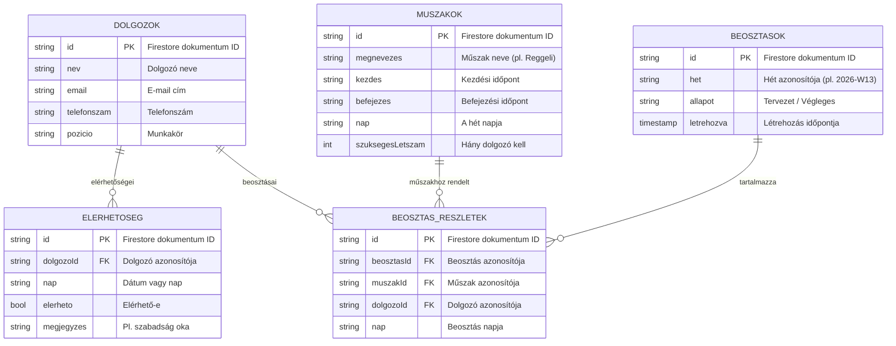

# 🗓️ Intelligens Munkaerő Beosztás Tervező

Egy webes alkalmazás, amely segíti a munkáltatókat a dolgozók műszakbeosztásának automatikus és intelligens tervezésében. A rendszer figyelembe veszi a dolgozók elérhetőségét, szabadságigényeit, és egy ütemezési algoritmus segítségével optimális beosztást generál.

> Projektlabor 2 – Egyetemi kurzus projekt

---

> **🧪 Teszteléshez Belépés és Regisztráció (Demo)**
> A rendszer egy szigorúbb, iparági sztenderd **BCrypt** jelszó-hashelést használ, így a korábbi hardcode-olt egyszerű jelszavakkal már nem lehet belépni.
> 1. A bejelentkező oldalon kattints a **"Nincs még fiókod? Kattints ide a regisztrációhoz."** feliratra.
> 2. Regisztrálj egy új felhasználót (teszteléshez szabadon választhatsz *HR* és *Dolgozó* szerepkörök között a legördülőből).
> 3. Regisztráció után a rendszer automatikusan be is jelentkeztet, és máris használhatod a portált!

---

## 📸 Képernyőfotók
*Helyezz ide képernyőfotókat az elkészült UI-ról a beadás előtt! (pl. ``)*

## ⚙️ Technológiai Stack
- **Backend:** C# .NET 8 Web API
- **Frontend:** React 19, Vite
- **Adatbázis:** Firebase Firestore (NoSQL)
- **Algoritmus:** Constraint Satisfaction Problem (CSP) Visszalépéses algoritmussal (NP-nehéz megoldó)
- **Infrastruktúra:** Docker, Docker Compose
- **Tesztelés:** xUnit, Moq (TDD szemlélet)

## 🐳 Docker Futtatás (Új!)
A projekt mikroszolgáltatás-alapú konténerizált futtatásra is fel van készítve. Csak telepített Docker szükséges:
```bash
docker-compose up --build
```
A frontend az `http://localhost:5173`, a backend a `http://localhost:8080` címen fog elindulni.

## 📖 Sprint Áttekintő

- [x] Sprint 1: Projekt alapok, dolgozó CRUD (REST API, React).
- [x] Sprint 2: Műszakok és elérhetőség kezelése (Firestore, DI).
- [x] Sprint 3: Alapvető beosztás generáló algoritmus.
- [x] Sprint 4: Premium UI, naptárnézet és tabulátoros navigáció (React).
- [x] Sprint 5: xUnit tesztek, algoritmus mockolása és GlobalException Middleware bevezetése.
- [x] Sprint 6: Szoftver dokumentáció (architektúra, tesztelési stratégia, napló) lezárása.
- [x] Sprint 7: NP-nehéz probléma megoldó (Backtracking CSP), Dockerizáció és felhős telepítési tervek.
- [x] Sprint 8: Szerepkör-alapú hitelesítés (JWT Auth), **BCrypt iparági jelszó-hashelés**, Teljes Regisztrációs felület (UI) és Adat-export (iCal Naptár szinkronizáció, CSV Excel).
- [x] Sprint 9: Vállalati szintű biztonság (Rate Limiting, Refresh Tokenek, Jelszó komplexitás, HSTS).

---

## 🔮 Jövőbeli Tervek (Továbbfejlesztési Lehetőségek)

A jelenlegi robusztus alapon túl a következő funkciók bevezetését tervezzük:

1. **Valós Idejű Értesítések (SignalR)**: A React kliensek automatikus push notifikációt kapnak, ha a HR egy új beosztást véglegesít, manuális frissítés nélkül.
2. **Mesterséges Intelligencia (AI) Integráció**: Prediktív ML.NET modellek bevonása, ami előre megmondja az optimális heti szükséges létszámot történelmi forgalmi adatok és ünnepek alapján. Valamint egy LLM (Nyelvi Modell) "Asszisztens" gomb beépítése a dolgozóknak, aki természetes nyelven tudja megmondani a beosztásokat ("Mikor dolgozom jövő héten?").
3. **Kompetenciamátrix (Skills Matrix)**: A dolgozókhoz speciális tudás (pl. *Targoncás*, *Idegennyelv*) rendelése, amit az NP-nehéz algoritmus "Hard Constraint"-ként kezel. Ezen felül "Soft Constraints" (személyes preferenciák) figyelembevétele a beosztás generálása során az elégedettség növeléséért.

---

## 📂 Projekt struktúra

```
Projektlabor 2/
├── MuszakBeosztasAPI/          # C# Web API backend
│   ├── Controllers/            # REST API végpontok
│   ├── Models/                 # Adatmodellek
│   ├── Services/               # Üzleti logika (Firestore műveletek)
│   ├── Middleware/             # Hibakezelés, autentikáció
│   ├── Program.cs              # Alkalmazás konfiguráció
│   └── firebase-config.json    # Firebase kulcs (gitignored!)
├── MuszakBeosztasAPI.Tests/    # xUnit egységtesztek
├── muszak-beosztas-ui/         # React frontend
│   └── src/
│       ├── components/         # React komponensek
│       └── services/           # API hívások
├── docs/                       # Projekt dokumentáció
│   ├── architektura.md         # Rendszer architektúra
│   ├── fejlesztesi-modszertan.md # Agilis módszertan
│   ├── munkanaplo.md           # Sprint munkanapló
│   ├── team-szervezes.md       # Csapat szervezés
│   └── tesztelesi-strategia.md # Tesztelési terv
└── README.md
```

---

## 🗄️ Adatbázis Architektúra

Az alkalmazás **Firebase Firestore** NoSQL adatbázist használ. Az alábbi diagram mutatja a tervezett kollekciókat és azok kapcsolatait:



### Kollekciók összefoglalása

| Kollekció | Leírás | Bevezetés |
|-----------|--------|-----------|
| `dolgozok` | Munkavállalók adatai | Sprint 1 |
| `muszakok` | Műszak típusok (reggeli, délutáni, éjszakai) | Sprint 2 |
| `elerhetoseg` | Dolgozók elérhetősége és szabadságigényei | Sprint 2 |
| `beosztasok` | Generált heti beosztások | Sprint 3 |
| `beosztasReszletek` | Egy beosztáson belüli egyedi hozzárendelések | Sprint 3 |

---

## 🚀 Lokális futtatás

### Előfeltételek

- [.NET 8 SDK](https://dotnet.microsoft.com/download/dotnet/8.0)
- [Node.js 18+](https://nodejs.org/)
- Firebase projekt Firestore-ral (lásd lentebb)

### 1. Firebase beállítása

1. Hozz létre egy projektet a [Firebase Console](https://console.firebase.google.com/)-ban
2. Engedélyezd a **Firestore Database**-t
3. Menj a **Projektbeállítások → Szolgáltatásfiókok** oldalra
4. Kattints az **„Új privát kulcs létrehozása"** gombra
5. Mentsd el a letöltött JSON fájlt mint `MuszakBeosztasAPI/firebase-config.json`
6. Frissítsd az `appsettings.json`-ben a `Firebase:ProjektAzonosito` értékét a saját projekt ID-dra

### 2. Backend indítása

```bash
cd MuszakBeosztasAPI
dotnet run
```

Az API elérhető lesz: `http://localhost:5148` (a pontos port a konzolban jelenik meg)

### 3. Frontend indítása

```bash
cd muszak-beosztas-ui
npm install
npm run dev
```

A webalkalmazás elérhető lesz: `http://localhost:5173`

---

## 📋 Fejlesztési Napló (Sprint-alapú)

### ✅ Sprint 1 – Projekt alapok és Dolgozó CRUD
- Projekt struktúra kialakítása (C# Web API + React)
- Firebase Firestore kapcsolat beállítása
- Dolgozó (Employee) adatmodell létrehozása
- CRUD műveletek megvalósítása (létrehozás, listázás, módosítás, törlés)
- REST API végpontok: `GET/POST/PUT/DELETE /api/dolgozo`
- React frontend: dolgozó hozzáadása és listázása
- Swagger UI konfiguráció fejlesztési módban
- `start.bat` script a backend + frontend egyidejű indításához

### ✅ Sprint 2 – Műszakok és Elérhetőség
- Műszak (Muszak) adatmodell és Firestore CRUD service
- REST API végpontok: `GET/POST/PUT/DELETE /api/muszak`
- Elérhetőség (Elerhetoseg) adatmodell és service
- REST API végpontok: `GET/POST/DELETE /api/elerhetoseg`
- Dolgozó szűrés endpoint: `GET /api/elerhetoseg/dolgozo/{dolgozoId}`
- React frontend: MuszakForm, MuszakLista komponensek
- React frontend: ElerhetosegKezelo komponens
- Tab-alapú navigáció implementálása (Dolgozók | Műszakok | Elérhetőség | Beosztás)
- Program.cs frissítés: MuszakService, ElerhetosegService DI regisztráció

### ✅ Sprint 3 – Ütemezési Algoritmus
- Beosztas adatmodell (hét azonosító, állapot, létrehozás időpont)
- BeosztasReszlet adatmodell (dolgozó-műszak hozzárendelés)
- Greedy ütemezési algoritmus implementálása:
  - Elérhetőség alapú dolgozó-műszak párosítás
  - Egyenletes terhelés elosztás
  - Ütközés elkerülés (egy dolgozó / nap / max 1 műszak)
- REST API: `POST /api/beosztas/general/{het}` – beosztás generálás
- REST API: `GET /api/beosztas/{het}` – heti beosztás lekérdezés
- REST API: `PUT /api/beosztas/{id}/veglegesit` – véglegesítés
- Frontend beosztás service (API hívások)

### ✅ Sprint 4 – Beosztás Megjelenítés
- BeosztasNezet komponens – heti naptár grid (hétfő-vasárnap)
- HetValaszto komponens – hét navigáció (előre/hátra)
- Műszak színkódolás (reggeli=kék, délutáni=narancs, éjszakai=sötétkék)
- Dolgozó nevek megjelenítése a naptár cellákon belül
- Premium UI redesign: modern dizájn, glassmorphism, animációk
- Reszponzív layout (mobil + desktop)

### ✅ Sprint 5 – Tesztelés, Ütközéskezelés és Teljesítmény
- xUnit teszt projekt létrehozása (`MuszakBeosztasAPI.Tests`)
- Egységtesztek: DolgozoService, MuszakService CRUD műveletek
- Egységtesztek: Ütemezési algoritmus logika (helyes elosztás, ütközés)
- Integrációs tesztek: Controller végpontok (WebApplicationFactory)
- GlobalExceptionHandler middleware (strukturált ProblemDetails hibaválaszok)
- Teljesítményoptimalizálás: Firestore lekérdezés hatékonyság
- Response Compression middleware

### ✅ Sprint 6 – Autentikáció és Véglegesítés
- Firebase Authentication integráció (backend JWT middleware)
- Login/Regisztráció frontend komponens (email/jelszó)
- Védett API végpontok (`[Authorize]` attribútum)
- Projekt dokumentáció véglegesítés (README, architektúra, módszertan)
- Munkanapló lezárás
- Utánkövetési terv és jövőbeli fejlesztési irányok dokumentálása

---

## 📚 Dokumentáció

A részletes dokumentáció a `docs/` mappában található:

| Dokumentum | Leírás |
|---|---|
| [Architektúra](docs/architektura.md) | Rendszer architektúra, rétegek, API végpontok |
| [Fejlesztési módszertan](docs/fejlesztesi-modszertan.md) | Agilis/Scrum, összehasonlítás más módszertanokkal |
| [Munkanapló](docs/munkanaplo.md) | Sprint-alapú fejlesztési napló |
| [Team szervezés](docs/team-szervezes.md) | Csapat felépítés, szerepkörök |
| [Tesztelési stratégia](docs/tesztelesi-strategia.md) | Egységtesztek, integrációs tesztek |

---

## 🔗 API Végpontok

| Metódus | Útvonal | Leírás |
|---|---|---|
| `GET` | `/api/dolgozo` | Összes dolgozó lekérdezése |
| `POST` | `/api/dolgozo` | Új dolgozó létrehozása |
| `PUT` | `/api/dolgozo/{id}` | Dolgozó módosítása |
| `DELETE` | `/api/dolgozo/{id}` | Dolgozó törlése |
| `GET` | `/api/muszak` | Összes műszak lekérdezése |
| `POST` | `/api/muszak` | Új műszak létrehozása |
| `PUT` | `/api/muszak/{id}` | Műszak módosítása |
| `DELETE` | `/api/muszak/{id}` | Műszak törlése |
| `GET` | `/api/elerhetoseg` | Összes elérhetőség |
| `GET` | `/api/elerhetoseg/dolgozo/{id}` | Egy dolgozó elérhetőségei |
| `POST` | `/api/elerhetoseg` | Elérhetőség beállítása |
| `DELETE` | `/api/elerhetoseg/{id}` | Elérhetőség törlése |
| `POST` | `/api/beosztas/general/{het}` | Beosztás generálása |
| `GET` | `/api/beosztas/{het}` | Heti beosztás lekérdezése |
| `PUT` | `/api/beosztas/{id}/veglegesit` | Beosztás véglegesítése |

> Swagger UI elérhető fejlesztési módban: `http://localhost:5148/swagger`

---

## 👨‍💻 Fejlesztő

Egyetemi projekt – Projektlabor 2 kurzus
