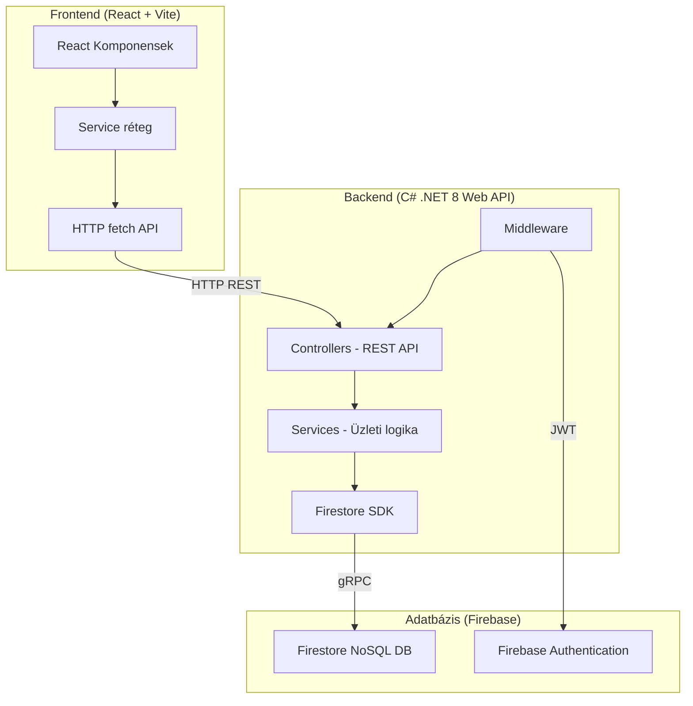
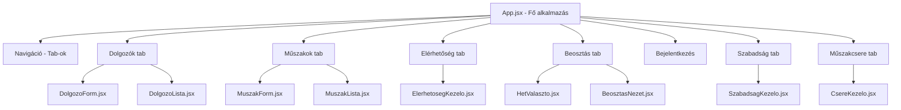
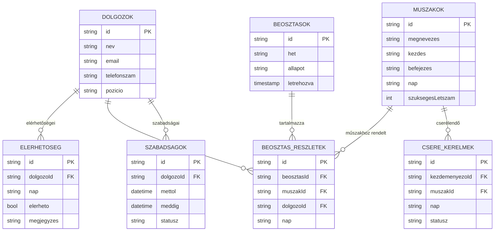
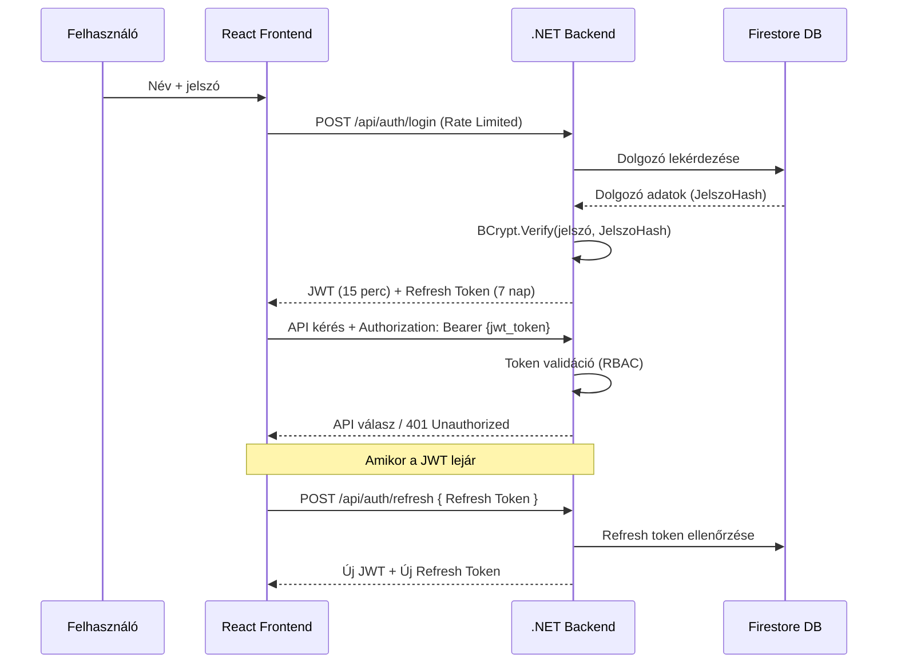

# Rendszer Architektúra – Intelligens Munkaerő Beosztás Tervező

## 1. Architektúra Áttekintés

Az alkalmazás **háromrétegű (three-tier) architektúrát** követ, ami elválasztja a megjelenítési, üzleti logika és adatelérési rétegeket.



---

## 2. Backend Architektúra

### Rétegek

| Réteg | Mappa | Felelősség |
|---|---|---|
| **Controllers** | `Controllers/` | HTTP végpontok, request/response kezelés, validáció |
| **Services** | `Services/` | Üzleti logika, adatmanipuláció, algoritmusok |
| **Models** | `Models/` | Adatmodellek (Firestore mapping) |
| **Middleware** | `Middleware/` | Cross-cutting concerns (auth, error handling) |

### Controller → Service minta

```csharp
// Controller: HTTP réteg (vékony)
[HttpGet]
public async Task<ActionResult<List<Dolgozo>>> OsszesLekerdezes()
{
    var dolgozok = await _szolgaltatas.OsszesLekerese();
    return Ok(dolgozok);
}

// Service: Üzleti logika (vastag)
public async Task<List<Dolgozo>> OsszesLekerese()
{
    var pillanatkep = await _firestore.Collection("dolgozok").GetSnapshotAsync();
    // ... adatfeldolgozás
}
```

### Dependency Injection

```csharp
builder.Services.AddSingleton(firestoreDb);      // Firestore DB (singleton)
builder.Services.AddScoped<DolgozoService>();      // Service-ek (request-scoped)
builder.Services.AddScoped<MuszakService>();
builder.Services.AddScoped<ElerhetosegService>();
builder.Services.AddScoped<BeosztasService>();
```

---

## 3. Frontend Architektúra

### Komponens hierarchia



### Service réteg

A frontend service fájlok a backend API-t hívják `fetch()` segítségével:

```
services/
├── dolgozoService.js      → /api/dolgozo
├── muszakService.js       → /api/muszak
├── elerhetosegService.js  → /api/elerhetoseg
├── beosztasService.js     → /api/beosztas
└── firebaseConfig.js      → Firebase Auth SDK
```

---

## 4. Adatbázis Architektúra

### Firebase Firestore kollekciók



### NoSQL vs SQL döntés

| Szempont | Firestore (NoSQL) | Hagyományos SQL |
|---|---|---|
| Séma | Rugalmas, séma nélküli | Merev séma |
| Skálázhatóság | Automatikus horizontális | Vertikális (költséges) |
| Lekérdezések | Egyszerű, indexelt | Komplex JOIN-ok |
| Hosting | Firebase (serverless) | Saját szerver szükséges |
| Valós idő | Beépített real-time listeners | Polling szükséges |

**Döntés:** Firestore-t választottuk a könnyű beállítás, serverless jelleg, és a Firebase ökoszisztéma (Authentication integrálás) miatt.

---

## 5. API Végpontok

### REST API konvenciók

| Metódus | Útvonal | Leírás |
|---|---|---|
| `GET` | `/api/dolgozo` | Összes dolgozó |
| `GET` | `/api/dolgozo/{id}` | Egy dolgozó |
| `POST` | `/api/dolgozo` | Új dolgozó |
| `PUT` | `/api/dolgozo/{id}` | Dolgozó módosítás |
| `DELETE` | `/api/dolgozo/{id}` | Dolgozó törlés |
| `GET` | `/api/muszak` | Összes műszak |
| `POST` | `/api/muszak` | Új műszak |
| `PUT` | `/api/muszak/{id}` | Műszak módosítás |
| `DELETE` | `/api/muszak/{id}` | Műszak törlés |
| `GET` | `/api/elerhetoseg` | Összes elérhetőség |
| `GET` | `/api/elerhetoseg/dolgozo/{dolgozoId}` | Egy dolgozó elérhetőségei |
| `POST` | `/api/elerhetoseg` | Elérhetőség beállítás |
| `DELETE` | `/api/elerhetoseg/{id}` | Elérhetőség törlés |
| `POST` | `/api/beosztas/general/{het}` | Beosztás generálás |
| `GET` | `/api/beosztas/{het}` | Heti beosztás lekérdezés |
| `PUT` | `/api/beosztas/{id}/veglegesit` | Beosztás véglegesítés |
| `GET` | `/api/szabadsag` | Összes szabadság kérelem |
| `POST` | `/api/szabadsag` | Új szabadság igénylése |
| `PUT` | `/api/szabadsag/{id}/statusz` | Szabadság elfogadása/elutasítása |
| `GET` | `/api/csere` | Összes csere kérelem |
| `POST` | `/api/csere` | Új csere kérés leadása |
| `PUT` | `/api/csere/{id}/statusz` | Csere jóváhagyása |

---

## 6. Biztonsági Architektúra

### Autentikációs Flow (BCrypt + JWT + Refresh Token)

A rendszer saját JWT alapú autentikációt használ, a jelszavak iparági sztenderd **BCrypt** hasheléssel vannak védve az adatbázisban. A maximális biztonság érdekében a JWT tokenek élettartama csak 15 perc, amit a kliens transzparensen újít meg a **Refresh Token** segítségével.



### Biztonsági Rétegek (Defense-in-Depth)
1. **IP Rate Limiting:** A `[EnableRateLimiting]` attribútum védi az Authentication végpontokat (max 5 próbálkozás / perc) a Brute-Force támadásokkal szemben.
2. **Jelszó Komplexitás:** Szigorú Regex biztosítja, hogy a dolgozók erős jelszavakat használjanak (kisbetű, nagybetű, szám, min 8 karakter).
3. **CORS konfiguráció:** Csak a frontend szerver IP-je / domainje engedélyezett.
4. **HSTS & HTTPS Redirection:** Éles környezetben (Production) az alkalmazás minden forgalmat titkosított csatornára terel.

```csharp
szabaly.WithOrigins("http://localhost:5173")  // Csak a React kliens
       .AllowAnyHeader()
       .AllowAnyMethod();
```
