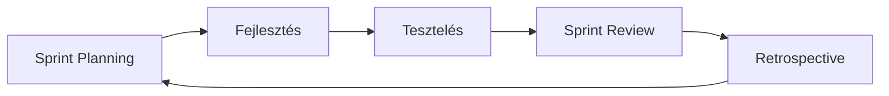

# Fejlesztési Módszertan – Projekt Labor 2

## 1. Választott módszertan: Agilis (Scrum)

### Miért az Agilis/Scrum?

A projekt jellegéből adódóan (6 hetes egyetemi kurzus, iteratív fejlesztés, folyamatos visszajelzés) az **Agilis Scrum** módszertant választottuk. Ez lehetővé teszi:

- **Rövid sprintek** (1 hét = 1 sprint) → gyors iteráció
- **Inkrementális fejlesztés** → minden sprint végén működő szoftver
- **Rugalmasság** → a követelmények pontosítása menet közben
- **Folyamatos integráció** → Git-alapú verziókezelés

### Scrum szerepkörök (egyéni projekt adaptáció)

| Szerepkör | Felelős | Megjegyzés |
|---|---|---|
| Product Owner | Fejlesztő | A követelmények priorizálása |
| Scrum Master | Fejlesztő | A sprint folyamat felügyelete |
| Development Team | Fejlesztő | Teljes stack fejlesztés |

> **Megjegyzés:** Egyéni projektnél a szerepkörök egy személyre összpontosulnak, de a módszertan elvei továbbra is érvényesek.

---

## 2. Összehasonlítás más módszertanokkal

### Vízesés modell (Waterfall)

```
Követelmény → Tervezés → Implementáció → Tesztelés → Karbantartás
```

- **Előny:** Egyszerű, lineáris folyamat
- **Hátrány:** Nem rugalmas, a hibák későn derülnek ki
- **Miért nem választottuk:** A kurzus iteratív jellegéhez nem illik, nincs lehetőség visszalépésre

### V-modell

```
Követelmény ←→ Átvételi teszt
  Tervezés  ←→ Rendszerteszt
    Részletes tervezés ←→ Integrációs teszt
      Implementáció ←→ Egységteszt
```

- **Előny:** Minden fejlesztési fázishoz tartozik tesztelési fázis
- **Hátrány:** Merev struktúra, nehéz módosítani menet közben
- **Miért nem választottuk:** Túl formális egy 6 hetes projekthez

### Prototípus modell

- **Előny:** Gyors visszajelzés a felhasználótól
- **Hátrány:** A prototípus gyakran a végtermékké válik (rossz minőségben)
- **Kapcsolat a projekthez:** A Sprint 1 gyakorlatilag egy prototípus, amit iteratívan fejlesztünk tovább

### Iteratív és inkrementális módszertan

- **Előny:** Minden iteráció egy működő szoftvert ad
- **Kapcsolat:** A Scrum sprintek pontosan ezt valósítják meg
- **A mi projektünkben:** Minden sprint egy új funkcionális réteget ad hozzá

### RAD (Rapid Application Development)

- **Előny:** Gyors fejlesztés, prototípus-alapú
- **Hátrány:** Kevésbé strukturált
- **Kapcsolat:** A React + Vite gyors fejlesztési ciklust biztosít (HMR)

### Kanban

- **Előny:** Folyamatos flow, WIP limitek
- **Hátrány:** Nincs fix sprint határidő
- **Kapcsolat:** A sprinteken belüli feladatokat Kanban-szerűen kezeljük (TODO → In Progress → Done)

---

## 3. Sprint struktúra

### Sprint ceremóniák (adaptált)

| Ceremónia | Időpont | Leírás |
|---|---|---|
| Sprint Planning | Sprint eleje | Feladatok definiálása, priorizálás |
| Daily Standup | Minden munkanap | Haladás áttekintése (egyéni reflexió) |
| Sprint Review | Sprint vége | Elkészült funkciók bemutatása |
| Sprint Retrospective | Sprint vége | Mi ment jól? Mi lehetne jobb? |

### Sprint ciklus



### Definition of Done (DoD)

Egy feature akkor tekinthető késznek, ha:
1. ✅ A kód megírt és kommentezett
2. ✅ A tesztek lefutnak (ha van teszt)
3. ✅ A kód commitolva van Git-be
4. ✅ A README/dokumentáció frissítve
5. ✅ Nincs ismert, kritikus bug

---

## 4. Verziókezelési stratégia

### Branch modell

```
main (stabil, release-ready)
  └── develop (fejlesztési ág)
        ├── feature/sprint-2-muszakok
        ├── feature/sprint-3-algoritmus
        └── feature/sprint-4-ui
```

### Commit konvenciók

```
feat: Új funkció hozzáadása
fix: Hibajavítás
docs: Dokumentáció módosítás
test: Teszt hozzáadása/módosítása
refactor: Kód átstrukturálás
style: Formázás, stílus változás
chore: Egyéb (build, config)
```

**Példák:**
- `feat: Műszak CRUD backend implementálás`
- `fix: Dolgozó törlés hiba javítása`
- `docs: Sprint 2 munkanapló frissítés`
- `test: DolgozoService egységtesztek`

---

## 5. Felhasznált források

- [Agilis szoftverfejlesztés – SZTE](https://www.inf.szte.hu/~beszedes/teaching/agilis/index.html)
- [Agilis módszertanok](https://wizape.com/Magyar/Agilis-m%C3%B3dszertanok-a-szoftverfejleszt%C3%A9sben)
- [Szoftverfejlesztés alapjai – BME VIK](https://vik.wiki/images/4/45/Sztt_eloadas_10.pdf)
- [Agilis szoftverfejlesztés – beos.hu](https://beos.hu/agilis-szoftverfejlesztes-modszertan-definicio-es-alapelvek-magyarazata/)
